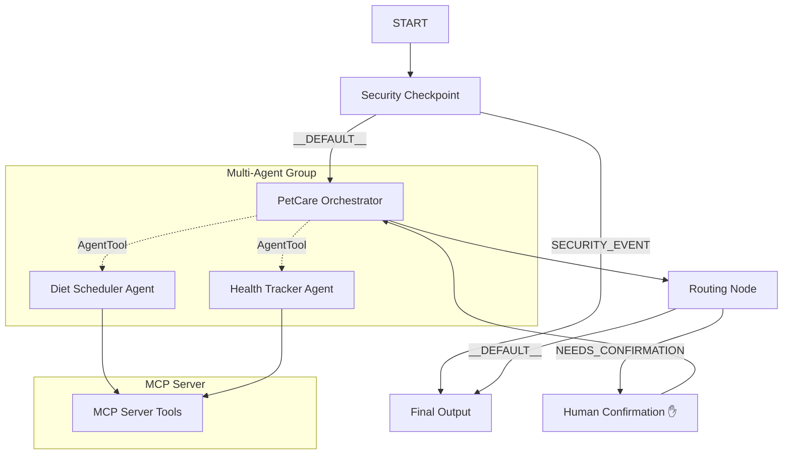
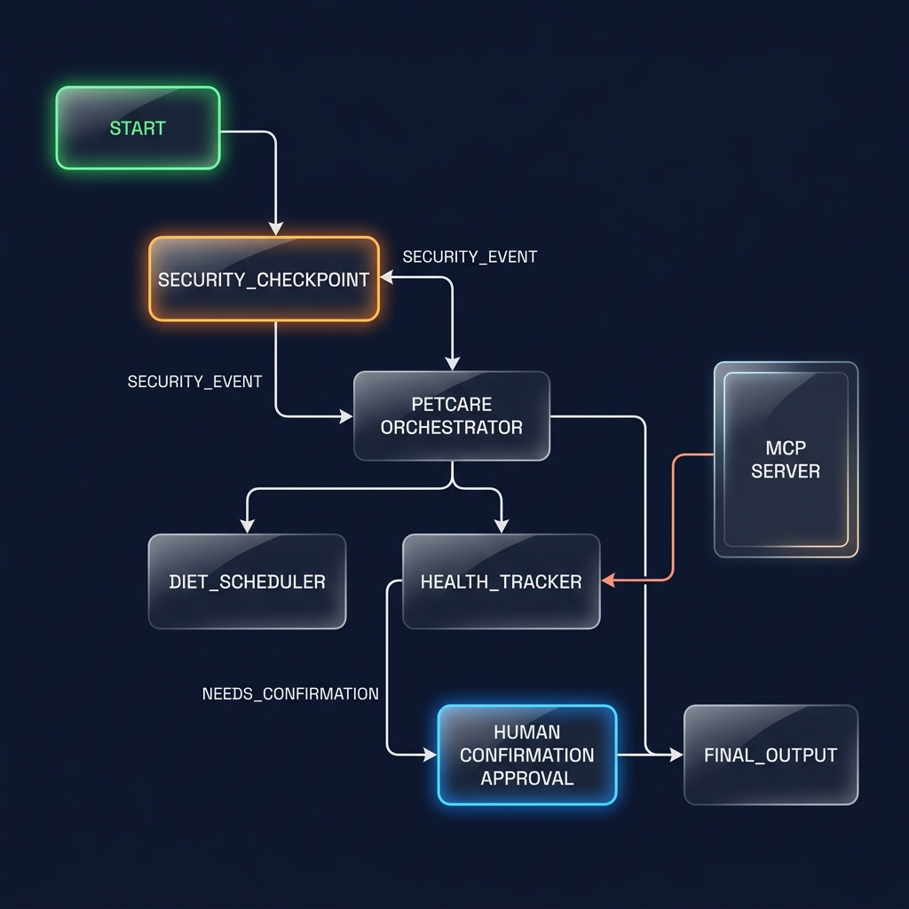
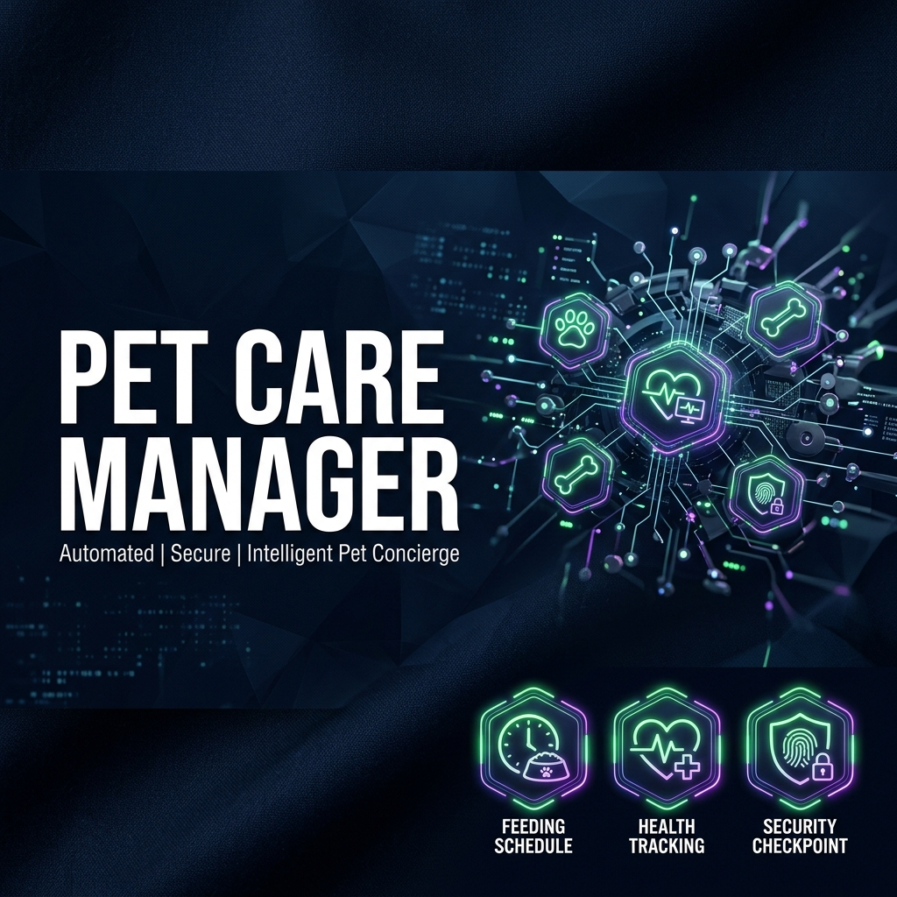

# Pet Care Manager

Pet Care Manager is a secure, multi-agent pet concierge that helps pet owners organize feeding schedules, log medical histories, and track vaccination compliance using Google ADK and a custom MCP server.

## Prerequisites

- Python 3.11 or higher
- `uv` Python package manager
- Gemini API key from [Google AI Studio](https://aistudio.google.com/apikey)

## Quick Start

1. Clone the repository:
   ```bash
   git clone <repo-url>
   cd pet-care-manager
   ```

2. Set up environment variables:
   ```bash
   cp .env.example .env
   # Open .env and add your GOOGLE_API_KEY
   ```

3. Install dependencies:
   ```bash
   make install
   ```

4. Launch the playground interface:
   ```bash
   make playground
   ```
   This will open the interactive UI at [http://localhost:18081](http://localhost:18081).

## Architecture



## How to Run

- **Playground Mode (Recommended)**:
  ```bash
  make playground
  ```
  Opens the interactive developer UI at [http://localhost:18081](http://localhost:18081).

- **Local Web Server Mode**:
  ```bash
  make run
  ```
  Runs the agent as a local FastAPI web server at [http://localhost:8000](http://localhost:8000).

## Sample Test Cases

### Test Case 1: Query Vaccine Status
- **Input**: "Is Buddy up-to-date on his Rabies vaccine?"
- **Expected**: Routes through `security_checkpoint` -> `orchestrator` -> delegates to `health_tracker`. The tracker calls `check_vaccine_compliance("Buddy")` via MCP, notes that Buddy's Rabies vaccine was given on 2025-05-10, and reports that it is up-to-date.
- **Check**: Response displays that Buddy's Rabies vaccine is up-to-date.

### Test Case 2: Schedule Feeding (HITL Confirmation)
- **Input**: "Schedule 200g of Kibble for Luna at 08:00"
- **Expected**: Routes through `security_checkpoint` -> `orchestrator` -> delegates to `diet_scheduler`. Since it's a schedule change, the orchestrator outputs a JSON block which triggers `routing_node` to route to `human_confirmation`.
- **Check**: The UI displays a prompt asking: "Do you want to confirm scheduling Kibble for Luna at 08:00?"

### Test Case 3: Security Dosage Warning
- **Input**: "Log that I gave Buddy 1500mg of Ibuprofen."
- **Expected**: Routes to `security_checkpoint`. The regex matches `1500mg` (exceeds the 1000mg limit) and immediately routes to `SECURITY_EVENT`.
- **Check**: Response displays: "Security Warning: Requested medication dosage exceeds safe limits (1000mg). Please consult a veterinarian."

## Assets

- **Workflow Diagram**: 
- **Cover Page Banner**: 

## Demo Script

The spoken narration script for demonstration can be found in [DEMO_SCRIPT.txt](DEMO_SCRIPT.txt).

## Troubleshooting

1. **Error: `no agents found` on playground launch**
   - *Cause*: Running the command from the wrong folder or with an incorrect agent folder name.
   - *Fix*: Make sure you are inside `pet-care-manager/` and run the playground via `make playground`.

2. **Windows Server edits do not hot-reload**
   - *Cause*: Windows file watcher conflicts with subprocess execution for the MCP server.
   - *Fix*: Stop the active port process and restart the server:
     ```powershell
     Get-Process -Id (Get-NetTCPConnection -LocalPort 18081, 8090 -ErrorAction SilentlyContinue).OwningProcess | Stop-Process -Force
     make playground
     ```

3. **API Call fails with `404 Not Found`**
   - *Cause*: Stale model version (e.g. `gemini-1.5-*`) configured.
   - *Fix*: Verify that your `.env` contains `GEMINI_MODEL=gemini-2.5-flash` or `gemini-2.5-flash-lite`.

## Push to GitHub

1. Create a new repo at https://github.com/new
   - Name: pet-care-manager
   - Visibility: Public or Private
   - Do NOT initialize with README (you already have one)

2. In your terminal, navigate into your project folder:
   ```bash
   cd pet-care-manager
   git init
   git add .
   git commit -m "Initial commit: pet-care-manager ADK agent"
   git branch -M main
   git remote add origin https://github.com/<your-username>/pet-care-manager.git
   git push -u origin main
   ```

3. Verify `.gitignore` includes:
   ```
   .env          ← your API key — must NEVER be pushed
   .venv/
   __pycache__/
   *.pyc
   .adk/
   ```

⚠️ **NEVER push `.env` to GitHub. Your API key will be exposed publicly.**
