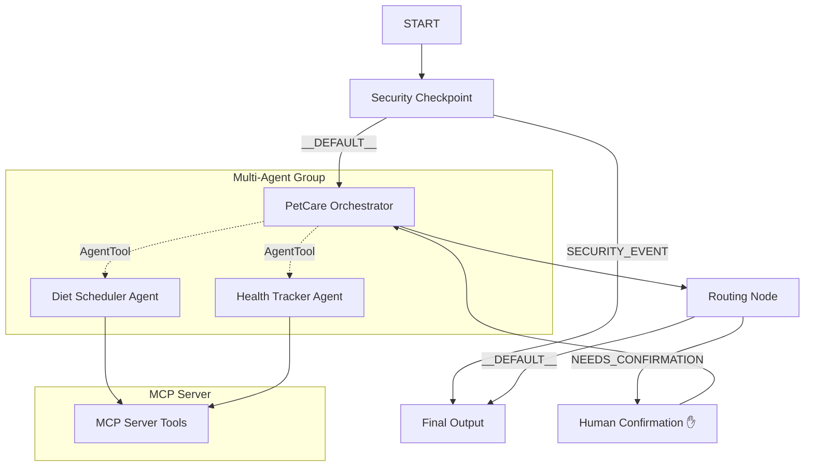

# Submission Writeup: Pet Care Manager

## Problem Statement
Pet care involves managing diverse schedules, medical records, vaccination dates, and nutritional plans. Owners often struggle to coordinate clinical history and daily feeding routines, leading to missed boosters or dietary inconsistency. The Pet Care Manager addresses this need by providing a secure, intelligent concierge that interfaces with database tools and validates actions with the owner before execution.

## Solution Architecture

## Concepts Used

1. **ADK Workflow Graph API**:
   - Implemented in [agent.py](app/agent.py#L254-L270) using the `Workflow` class with custom nodes and edges.
2. **LlmAgent**:
   - Three LLM agents defined: `orchestrator`, `diet_scheduler`, and `health_tracker` in [agent.py](app/agent.py#L42-L113).
3. **AgentTool**:
   - Used in the orchestrator definition to delegate sub-tasks to the specialists in [agent.py](app/agent.py#L112).
4. **MCP Server**:
   - Created in [mcp_server.py](app/mcp_server.py) using the FastMCP Python SDK, exposing study, logging, and checking tools.
5. **Security Checkpoint**:
   - Built as a custom function node `security_checkpoint()` in [agent.py](app/agent.py#L119-L180).
6. **Agents CLI**:
   - Scaffolding, dependency control, and playground testing managed via `agents-cli`.

## Security Design
- **PII Scrubbing**: We use regular expressions in the security node to redact owner contact details (phone numbers, emails) before sending input to the LLM. This prevents data leaks.
- **Prompt Injection Prevention**: Keyword checks detect standard bypass phrases and route requests directly to a security event terminal node, shielding the system.
- **Dosage Verification**: A domain-specific guardrail checks if requested medication dosages exceed 1000mg, returning a clinical warning to prevent accidental overdose logs.
- **Audit Logging**: Every incoming query generates a structured JSON audit log in standard output specifying security evaluation results and severity levels.

## MCP Server Design
- `get_pet_profile(pet_name)`: Returns pet breed, weight, vaccines, and feedings history.
- `schedule_feeding(...)`: Inserts a structured feeding time and quantity entry.
- `check_vaccine_compliance(pet_name)`: Computes vaccine status against current date (2026) to find expired records.
- `log_vet_visit(...)`: Records diagnostic notes and automatically updates matching vaccine administration dates.

## Human-in-the-Loop (HITL) Flow
To protect the database integrity, all schedule modifications or vet visit logs must be explicitly approved by the user. If the orchestrator detects an update intent, it structures an action payload and triggers a `RequestInput` pause. The user is prompted for a "yes/no" confirmation, ensuring no accidental logs occur.

## Demo Walkthrough
1. **Vaccine Tracking**: Querying vaccine compliance invokes the MCP tool and summarizes compliant vs expired shots (e.g. Buddy's Rabies vaccine check).
2. **Schedule Change**: Attempting to schedule a feeding outputs a confirmation dialog, prompting the user for approval. If approved, the feeding is logged.
3. **Overdose Guardrail**: Asking to log 1500mg of medication fails immediately with a clinical warning due to security rules.

## Impact & Value Statement
Pet Care Manager streamlines pet wellness administration. By coordinating dietary details, tracking medical timelines, and enforcing verification gates, it offers peace of mind to pet owners and vet professionals, reducing clinic errors and promoting pet safety.
